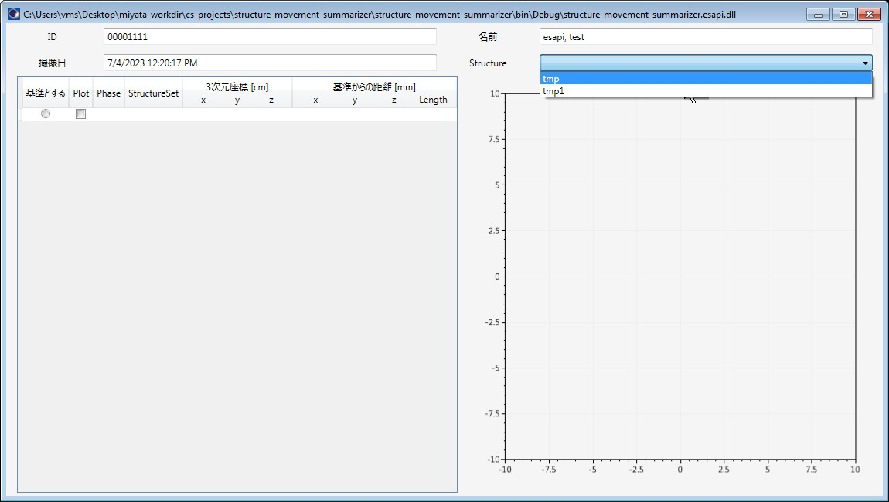

# structure_movement_summarizer_esapi_v15_5

ESAPI Binary Plugin for checking the movement of a Structure in 4D CT images.

If a Structure with the same ID is found in 10 or more phases, the Structure is included in the analysis.

This is in the process of i8n.

## How to use

Treat as 4D CTs that have the same `ScriptContext.Image.FOR` and phase description in `ScriptContext.Patient.StructureSets[i].Image.Series.Comment` .

Open any 4D CT in External Beam Planning and run structure_movement_summariser_esapi_v15_5.esapi.dll from Tools > Scripts.

A window as above will be displayed, and select the Structure for which you want to check the amount of movement.

The following window will then be displayed.

It calculates the distance in each coordinate axis direction from the reference (the phase with the "基準とする (Reference)" checked), and its L2 Norm.

The "基準とする (Reference)" phase and the phases to plot can be selected.

## LICENSE

Released under the MIT license.

No responsibility is assumed for anything that occurs with this software.

See [LICENSE](https://github.com/akiaji-k/plan_checker_gui_esapi_v15_5/blob/main/LICENSE) for further details.

