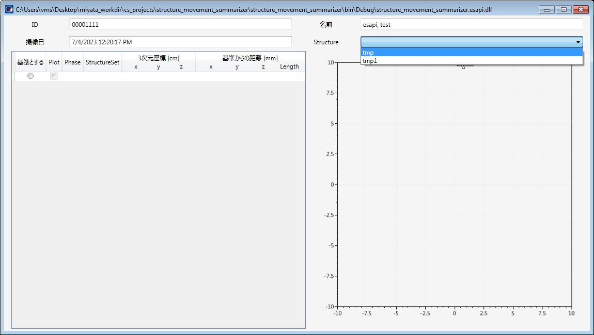
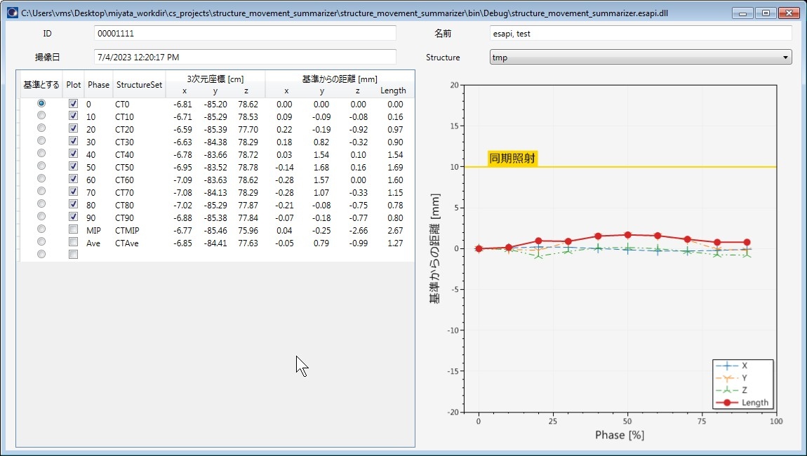
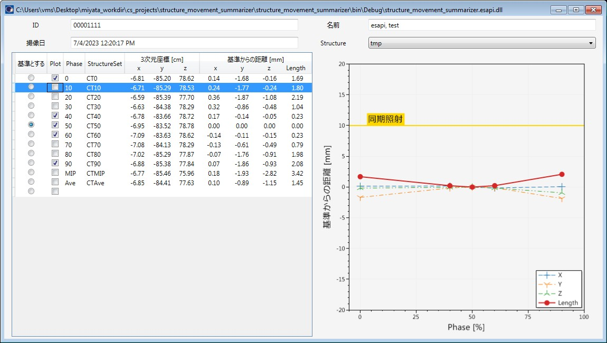

# structure_movement_summarizer_esapi_v15_5

4D CT 画像中の Structure の移動量を調べるための ESAPI Binary Plugin です。

10 相以上に同じ ID の Structure が含まれている場合、その Structure は解析対象になります。

本ソフトウェアの多言語への翻訳は途中です。

## 使用方法

4D CT は、`ScriptContext.Image.FOR` が等しく、`ScriptContext.Patient.StructureSets[i].Image.Series.Comment` に位相情報の記載があるものをひとまとまりとして扱います。

External Beam Planning で任意の 4D CT を開いた上で、Tools > Scripts から structure_movement_summarizer_esapi_v15_5.esapi.dll を実行します。

上記のような画面が表示されますので、移動量を調べたい Structure を選択します。

すると、以下のような画面が表示されます。

4D CT の画像について、`Structure.CenterPoint` property から得られる３次元座標を取得します。また、各座標軸方向の基準（"基準とする" にチェックが入っている位相）からの距離と、その L2 Norm を計算します。

"基準とする" 位相やプロットする位相は選択可能です。

## ライセンス

MIT ライセンスで公開されています。

本ソフトウェアで発生したことについて、いかなる責任も負いません。

詳細は [LICENSE](https://github.com/akiaji-k/plan_checker_gui_esapi_v15_5/blob/main/LICENSE) をご確認ください。
